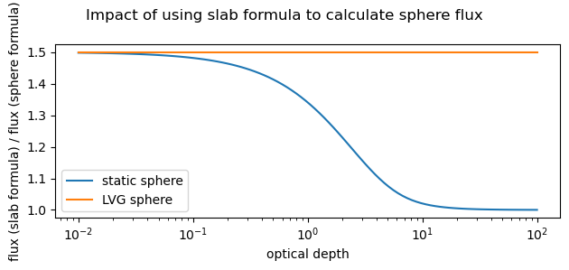

Differences between ``pythonradex`` and ``RADEX``
------------------------------------------------------

Overlapping lines and internal continuum
^^^^^^^^^^^^^^^^^^^^^^^^^^^^^^^^^^^^^^^^^^^^^^^^^^^^^^^
``pythonradex`` is able to handle excitation effects of overlapping lines (i.e. lines that are so close in frequency that photons emitted from one line can be absorbed by another line). ``pythonradex`` is also able to include effects of an internal radiation field specified by the user (typically arising from dust that is mixed with the gas). Both of these effects are not included in ``RADEX``.

Programming language and performance
^^^^^^^^^^^^^^^^^^^^^^^^^^^^^^^^^^^^^^^^^^^^^
While ``RADEX`` is written in Fortran, ``pythonradex`` is written in python. Simple performance tests suggest that ``pythonradex`` outperforms ``RADEX`` in the typical use case of calculating several models over a grid of parameters (e.g. column density, temperature). The speed advantage of ``pythonradex`` from these tests ranges from ~2 up to more than 10, depending on the input parameters and the computing environment. To optimize its performance, ``pythonradex`` employs an architecture that avoids unnecessary or repeating calculations as much as possible. In addition, it uses just-in-time compilation using the `numba <https://numba.readthedocs.io>`_ package.

Different flux output
^^^^^^^^^^^^^^^^^^^^^^^^^^^^
There is a difference between the outputs of ``RADEX`` and ``pythonradex``. The ``RADEX`` output :math:`T_R` (or the corresponding flux outputs) is intended to be directly compared to telescope data. To be more specific, from the optical depth and excitation temperature, ``RADEX`` first computes :math:`I_\mathrm{tot} = B_\nu(T_\mathrm{ex})(1-e^{-\tau}) + I_\mathrm{bg}e^{-\tau}`, i.e. the total specific intensity at the line centre that is recorded at the telescope, where :math:`I_\mathrm{bg}` is the background radiation. This is the sum of the radiation from the gas (first term) and the background radiation attenuated by the gas (second term). From this, ``RADEX`` assumes the observer has subtracted the background, giving :math:`I_\mathrm{measured} = I_\mathrm{tot} - I_\mathrm{bg} = (B_\nu(T_\mathrm{ex})-I_\mathrm{bg})(1-e^{-\tau})`. The ``RADEX`` output :math:`T_R` is the Rayleigh-Jeans temperature corresponding to :math:`I_\mathrm{measured}`. This output may or may not be the right quantity to be compared to observations. For example, it is almost certainly not appropriate to be compared to interferometric data. On the other hand, ``pythonradex`` outputs the pure line emission without any background subtraction, i.e. the output corresponds simply to the emission emitted by the gas (for a slab geometry, the fluxes would be based on the specific intensity given simply by :math:`B_\nu(T_\mathrm{ex})(1-e^{-\tau}))`. This allows the user to decide how the flux should be compared to observations.

.. _sphere_flux_difference:

Different specific intensity and flux for spherical geometry
^^^^^^^^^^^^^^^^^^^^^^^^^^^^^^^^^^^^^^^^^^^^^^^^^^^^^^^^^^^^^^^^^^^^^^^^^^^^^^^^^
For a given excitation temperature :math:`T_{ex}` and optical depth :math:`\tau`, ``RADEX`` calculates the specific intensity as

.. math::
    I_\nu = B_\nu(T_{ex})(1-e^{-\tau})

for all geometries. However, this expression is only valid for slab geometries, but not for spherical geometries ("static sphere" and "LVG sphere"). In contrast, ``pythonradex`` uses different formulae for spherical geometries (see the :ref:`section about geometries<geometries>` for more details).

For a sphere, the specific intensity depends on the position on the sphere: if one looks towards the center of the sphere, it will be brighter than the sphere edges (because when looking through the center, the column density is higher), unless the sphere is completely optically thick. Therefore, the specific intensity, or brightness temperature, computed by ``RADEX`` using the above equation corresponds to what one would observe towards the center of the sphere if the observations resolved the sphere. On the other hand, ``pythonradex`` computes a sort of mean specific intensity, in the sense that if you multiply that specific intensity by the solid angle of the sphere (:math:`R^2\pi/d^2`, with :math:`R` the physical radius of the sphere and :math:`d` the distance), you get the correct total flux. So the specific intensity computed by ``pythonradex`` corresponds to what one would measure from unresolved observations (assuming the beam is filled, or a appropriate beam-filling factor is applied). Whether resolved or unresolved, ``pythonradex`` gives the correct total flux (W/m\ :sup:`2`), while ``RADEX`` might not (depending on the optical depth and geometry). The following figure illustrates the difference in flux that results from using different formulae. For a static sphere, using the slab formula (as done by ``RADEX``) overestimates the flux in the optically thin limit by a factor 1.5. This factor simply represents the volume ratio between a "spherical slab" (i.e. a cylinder) and a sphere. In the optically thick limit, only the surface of the static sphere is visible, so either formula gives the same result. On the other hand, for the LVG sphere, the difference is always a factor 1.5, regardless of optical depth. This is due to the LVG assumption that all photons escape unless absorbed locally.

.. This figure comes from joss_paper/code/compare_flux_formulae_spherical_geometry.py

   For the two spherical geometries, we computed the flux using the slab formula (as done by ``RADEX``) and formulae appropriate for a sphere (as done by ``pythonradex``). The figure shows the ratio of the fluxes as function of optical depth.

To verify that ``pythonradex`` calculates the flux correctly, one may consider the optically thin limit where the flux can be calculated directly. In this limit, all photons escape the source. The total flux (in [W/m\ :sup:`2`]) is then simply given by

.. math::
    F_\mathrm{thin} = V_\mathrm{sphere}nx_2A_{21}\Delta E \frac{1}{4\pi d^2}

where :math:`V_\mathrm{sphere}=\frac{4}{3}R^3\pi` is the volume of the sphere, :math:`n` the constant number density, :math:`x_2` the fractional level population of the upper level, :math:`A_{21}` the Einstein coefficient, :math:`\Delta E` the energy difference between the upper and lower level, and :math:`d` the distance of the source. ``pythonradex`` correctly reproduces this limiting case, but ``RADEX`` overestimates the optically thin flux by a factor 1.5.

Flux calculation
^^^^^^^^^^^^^^^^^^^^^^^^^^^^^^^^^^^^^^^^^^^^^^^^^^^^^^^^^^^^^^^^
``RADEX`` computes the flux by assuming that the flux density has a Gaussian profile (see Appendix A.2, point 5, in [vanderTak07]_). However, for optically thick lines, the flux density profile is not Gaussian, even if the intrinsic line profile (and thus optical depth profile) is. On the other hand, ``pythonradex`` calculates the flux by integrating over the flux density profile, thus taking its shape into account. Note though, as commented by [vanderTak07]_, that proper modelling of optically thick lines cannot really be achieved anyway by 1D codes like ``RADEX`` or ``pythonradex``.

Different escape probability for LVG sphere
^^^^^^^^^^^^^^^^^^^^^^^^^^^^^^^^^^^^^^^^^^^^^^^^^^^^^^^^^^^^^^^^
For the spherical LVG geometry, ``RADEX`` and ``pythonradex`` use different formulae to calculate the escape probability. Please see the :ref:`section about geometries<geometries>` for more details.

Different behaviour for H\ :sub:`2` collider densities
^^^^^^^^^^^^^^^^^^^^^^^^^^^^^^^^^^^^^^^^^^^^^^^^^^^^^^^^^^^^^^^^
Whenever the LAMDA-formatted molecular data file contains collisional rates for H\ :sub:`2`, but the user does not provide an H\ :sub:`2` density, ``RADEX`` just adds an H\ :sub:`2` density of :math:`10^5` cm\ :sup:`-3` by default to the calculation.

Furthermore, if the molecular data file contains rates for ortho-H\ :sub:`2` and para-H\ :sub:`2`, but not for H\ :sub:`2`, and the user supplies an H\ :sub:`2` density instead of densities for ortho-H\ :sub:`2` and para-H\ :sub:`2`, then ``RADEX`` will convert the supplied H\ :sub:`2` density into densities of H\ :sub:`2` and H\ :sub:`2` assuming a thermal ortho/para ratio.

On the other hand, ``pythonradex`` does not add H\ :sub:`2` by default, nor allow the user to request colliders that are not present in the molecular data file.