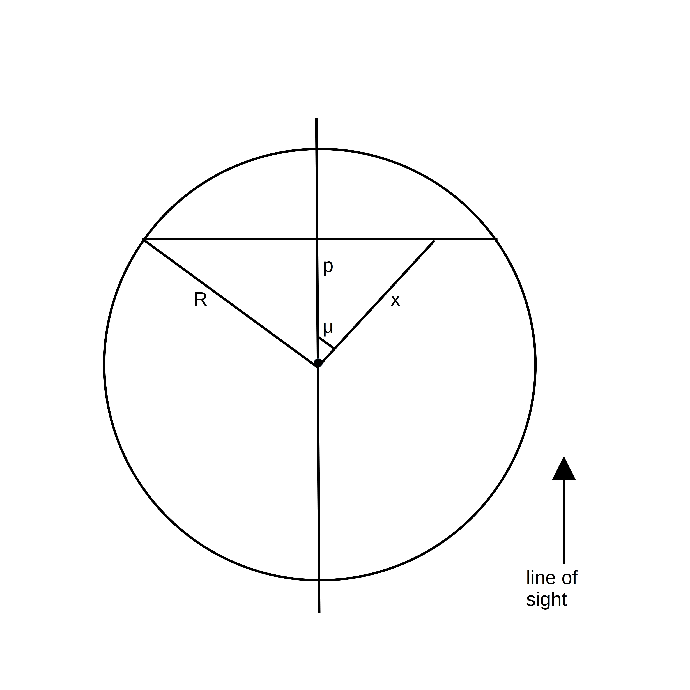

.. _geometries:

Source geometries
======================

The calculations of the escape probability and the emerging flux depend on the adopted geometry. Below we give an overview of the geometries available in ``pythonradex``. For all geometries, we assume a homogeneous medium (i.e. constant number density). For convenience, the escape probabilities are expressed as functions of optical depth :math:`\tau` rather than the absorption coefficient :math:`\alpha`. The specific intensities are expressed using the source function :math:`S_\nu`. In absence of dust and overlapping lines, it is simply given by the Planck function evaluated at the excitation temperature of the transition: :math:`S_\nu=B_\nu(T_\mathrm{ex})`.

Note that ``RADEX`` always uses the formula for a slab geometry to calculate the specific intensity, regardless of the adopted geometry. This is incorrect for spherical geometries. See :doc:`difference_pythonradex_RADEX` for more details.

Static sphere
----------------------
A homogeneous, static sphere. The escape probability is given in [Osterbrock74]_:

.. math::
    :name: eq:beta_static_sphere

    \beta(\tau) = \frac{3}{2\tau}\left(1-\frac{2}{\tau^2}+\left(\frac{2}{\tau}+\frac{2}{\tau^2}\right) e^{-\tau}\right)

where :math:`\tau` is the optical depth of the diameter of the sphere. The observed specific intensity (in [W/m\ :sup:`2`/Hz/sr]) can also be calculated from [Osterbrock74]_ and is given by:

.. math::
    :name: eq:intensity_static_sphere

    I_\nu = \frac{2S_\nu}{\tau^2}\left(\frac{\tau^2}{2}-1+(\tau+1)e^{-\tau}\right)

where :math:`S_\nu` is the source function. To get the flux density in [W/m\ :sup:`2`/Hz], one needs to multiply :math:`I_\nu` by the solid angle :math:`\Omega`, which is given by :math:`\Omega=R^2\pi/d^2` with :math:`R` the radius of the sphere and :math:`d` the distance of the source.

Note that if observations resolve the sphere, the specific intensity will not be constant across the source, unless it is completely optically thick. The specific intensity given above corresponds to the observed specific intensity for unresolved observations (or it can be interpreted as a kind of mean intensity).

Derivation of escape probability and flux density by Osterbrock (1974)
^^^^^^^^^^^^^^^^^^^^^^^^^^^^^^^^^^^^^^^^^^^^^^^^^^^^^^^^^^^^^^^^^^^^^^^^^^^^^^^^^^^^^^^^^^^^^^^^^^^^
Since the book by [Osterbrock74]_ is not easily accessible online, we present here the derivation of the escape probability and flux density for a static sphere. Consider the following sketch showing a sphere with optical depth :math:`\tau` along its diameter:

.. figure:: images/sketch_static_sphere.jpg
   :align: center
   :width: 70%
   :alt: Sketch of static sphere

   Static sphere with optical depth :math:`\tau` along the diameter. We consider a ray that makes an angle :math:`\theta` with respect to the outward normal. The optical depth along that ray is :math:`\tau\cos\theta`.

Consider a ray making an angle :math:`\theta` with respect to the outward normal. The optical depth along that ray is :math:`\tau\cos\theta`. Using the fact that the sphere is uniform (i.e. the emission coefficient :math:`j_\nu` is constant), the specific intensity in the direction of the ray, at the surface of the sphere, is given by (see [Rybicki04]_, equation 1.30)

.. math::

    I_\nu(\theta) = \frac{j_\nu}{\alpha}(1-e^{-\tau\cos\theta})

where :math:`\alpha` is the absorption coefficient. Next, we compute the outward flux density at the surface of the sphere (energy per unit area, time and frequency) by integrating over all outward directions. Here we use the solid angle element :math:`\mathrm{d}\Omega=\sin\theta\mathrm{d}\theta\mathrm{d}\phi`:

.. math::

    F_\nu^s = \int_0^{2\pi}\int_0^{\pi/2}I_\nu(\theta)\cos\theta\sin\theta\mathrm{d}\theta\mathrm{d}\phi  = \frac{2\pi j_\nu}{\alpha\tau^2}\left( \frac{\tau^2}{2}-1+(\tau+1)e^{-\tau} \right)

In this expression, the cosine is necessary to take into account the projection of the surface of the sphere with respect to the outward direction. To calculate the flux density observed at the telescope, we multiply :math:`F_\nu^s` with the surface of the sphere (:math:`4\pi R^2`) and divide by :math:`4\pi d^2` where :math:`d` is the distance to the source:

.. math::

    F_\nu =  \frac{2\pi j_\nu}{\alpha\tau^2}\left( \frac{\tau^2}{2}-1+(\tau+1)e^{-\tau} \right)\frac{4\pi R^2}{4\pi d^2}

Finally, :math:`F_\nu` is divided by the solid angle of the sphere :math:`\Omega=\frac{R^2\pi}{d^2}` to derive the observed specific intensity. Identifying the source function :math:`S_\nu=\frac{j_\nu}{\alpha}`, we recover :ref:`Eq. 2 <eq:intensity_static_sphere>`. To calculate the escape probability, we consider the flux density at the surface of the sphere in the optically thin limit where all photons escape. It is simply given by the total emission within the spherical volume, divided by the surface of the sphere:

.. math::

    F_\nu^{s,\mathrm{thin}} = \frac{\frac{4}{3}R^3\pi4\pi j_\nu}{4\pi R^2} = \frac{4\pi R j_\nu}{3}

where :math:`4\pi j_\nu` is the emission coefficient integrated over all directions (solid angles). Thus, the escape probability is given by

.. math::

    \beta(\tau) = \frac{F_\nu^s}{F_\nu^{s,\mathrm{thin}}} =  \frac{3}{2R\alpha\tau^2}\left( \frac{\tau^2}{2}-1+(\tau+1)e^{-\tau} \right) = \frac{3}{\tau^3}\left( \frac{\tau^2}{2}-1+(\tau+1)e^{-\tau} \right)

Here we used the definition of the optical depth (:math:`\tau=2R\alpha`). One easily verifies that the above expression is the same as :ref:`Eq. 1 <eq:beta_static_sphere>`.

Static slab
----------------------
A homogeneous, static slab. The escape probability is given by (e.g. [Elitzur92]_):

.. math::

    \beta(\tau) = \frac{\int_0^1 (1-e^{-\tau/\mu})\mu\mathrm{d}\mu}{\tau}

The specific intensity (in [W/m\ :sup:`2`/Hz/sr]) is given by:

.. math::
    :name: eq:intensity_static_slab

    I_\nu = S_\nu(1-e^{-\tau})

To get the flux density in [W/m\ :sup:`2`/Hz], :math:`I_\nu` needs to be multiplied by the solid angle of the emitting region.

Derivation of escape probability for a homogeneous static slab
^^^^^^^^^^^^^^^^^^^^^^^^^^^^^^^^^^^^^^^^^^^^^^^^^^^^^^^^^^^^^^^^^^^^^^^
The escape probability for a static slab can be derived following a method similar to the static sphere. Consider a slab in the :math:`x`-:math:`y` plane with a thickness in the :math:`z`-direction of :math:`L`. It is assumed that the slab's extension in the :math:`x` and :math:`y` directions is much larger compared to its thickness. Consider a ray making an angle :math:`\theta` with the surface normal of the slab. The specific intensity is given by

.. math::

    I_\nu(\theta) = \frac{j_\nu}{\alpha}(1-e^{-\tau/\cos\theta})

where :math:`\tau` is the optical depth of the slab along the surface normal. As in the case of the static sphere, we derive the flux density at the surface of the slab:

.. math::

    F_\nu^s = 2\pi\int_0^{\pi/2}I_\nu(\theta)\cos\theta\sin\theta\mathrm{d}\theta = 2\pi\frac{j_\nu}{\alpha}\int_0^{\pi/2}(1-e^{-\tau/\cos\theta})\cos\theta\sin\theta\mathrm{d}\theta

Setting :math:`\mu=\cos\theta`, this transforms to

.. math::

    F_\nu^s = 2\pi\frac{j_\nu}{\alpha} \int_0^1(1-e^{-\tau/\mu})\mu\mathrm{d}\mu

Now consider the flux density in absence of absorption. Like for the sphere, it is given by the total emission within the volume of the slab, divided by its surface. Assume that one side of the slab (front or back side) has a surface area :math:`A` (thus the volume is :math:`A L`). Then

.. math::

    F_\nu^{s,\mathrm{thin}} = \frac{A L 4\pi j_\nu}{2A} = 2\pi j_\nu L

where :math:`2A` is the total surface area of the slab (front and back). Like for the static sphere, the escape probability is equal to the ratio :math:`F_\nu^s/F_\nu^{s,\mathrm{thin}}`:

.. math::

    \beta(\tau) = \frac{F_\nu^s}{F_\nu^{s,\mathrm{thin}}} = \frac{\int_0^1(1-e^{-\tau/\mu})\mu\mathrm{d}\mu}{\alpha L} = \frac{\int_0^1(1-e^{-\tau/\mu})\mu\mathrm{d}\mu}{\tau}

where the definition of optical depth was used for the last step.

LVG sphere
-------------------
The Large Velocity Gradient (LVG) approximation is applicable if the characteristic flow velocity along the line of sight is much larger than the local random (e.g. thermal) velocities (e.g. [Scoville74]_, [Elitzur92]_). In other words, all photons escape due to Doppler shifting, unless absorbed locally, that is, close to the emission location. The local region where an emitted photon can be absorbed is sometimes referred to as the *radiatively connected region*.

We use the model by [Goldreich74]_: A homogeneous sphere with a constant, radial velocity gradient :math:`\mathrm{d}v/\mathrm{d}r=V/R` where :math:`V` is the velocity at the sphere surface and :math:`R` is the radius of the sphere. The escape probability is given by (see e.g. Eq. 5 in [Goldreich74]_)

.. math::
    :name: eq:beta_LVG_sphere

    \beta(\tau) = \frac{1-e^{-\tau}}{\tau}

:math:`\tau` is the optical depth of the radiatively connected region. When looking through the centre of the sphere, the optical depth equals :math:`\tau` in the interval :math:`[-V,V]`, and is zero outside. The observed specific intensity can be derived by using an approach similar to [deJong75]_. Consider the following sketch:

   Sketch of an LVG sphere. We consider a radiatively connected region. It is a thin slab perpendicular to the line of sight, at a distance :math:`p` from the center of the sphere. The velocity projected onto the line of sight is constant in that slab.

The radiatively connected region along the line of sight is a thin slab perpendicular to the line of sight. Indeed, consider such a slab at a distance :math:`p` from the center of the sphere. The velocity projected onto the line of sight is indeed constant in the slab:

.. math::

    v_p = v(x)\cos\mu = v(x)\frac{p}{x} = \frac{V}{R}x \frac{p}{x} = \frac{V}{R}p

which is independent of :math:`x`. Here we used the assumption that the radial velocity gradient is constant and given by :math:`V/R`. Note that :math:`v_p` is proportional to :math:`p` (and :math:`p<0` if the slab is located in the half sphere closer to the observer), so each slab will have a different projected velocity. We again see that any photon escapes, unless absorbed locally (within the radiatively connected region).

To calculate the flux density at velocity :math:`v_p`, we can simply integrate over the solid angle of the slab as seen by the observer. At each point of the slab, the specific intensity is given by :math:`S_\nu(1-e^{-\tau})`, where it is understood that the frequency :math:`\nu` corresponds to the velocity :math:`v_p`, and :math:`\tau` is the optical depth of the slab. The element of solid angle is given by :math:`\mathrm{d}\Omega_p=\frac{r\mathrm{d}\phi\mathrm{d}r}{d^2}` where :math:`r` and :math:`\phi` are polar coordinates on the slab surface and :math:`d` is the distance to the observer. Thus, the flux density is given by

.. math::

    F_\nu = \int_0^{2\pi}\int_0^{\sqrt{R^2-p^2}}S_\nu(1-e^{-\tau})\frac{r}{d^2}\mathrm{d}r\mathrm{d}\phi = \frac{2\pi S_\nu}{d^2}(1-e^{-\tau})\int_0^{\sqrt{R^2-p^2}}r\mathrm{d}r

Using :math:`p=\frac{v_p R}{V}` and the solid angle of the sphere :math:`\Omega=\frac{R^2\pi}{d^2}`, this evaluates to

.. math::

    F_\nu = S_\nu(1-e^{-\tau})\Omega\left(1-\frac{v^2}{V^2}\right)

where we dropped the index :math:`p` from the velocity :math:`v`. The latter can be converted to frequency as :math:`v=c(1-\nu/\nu_0)` with :math:`c` the speed of light and :math:`\nu_0` the rest frequency. Note that the above equation applies for :math:`|v|\leq V`. For :math:`|v|>V`, the flux vanishes. Finally, the observed specific intensity is simply

.. math::

    I_\nu = F_\nu/\Omega = S_\nu(1-e^{-\tau})\left(1-\frac{v^2}{V^2}\right)

As in the case of the static sphere, also for the LVG sphere ``RADEX`` incorrectly uses the formula for a slab geometry to calculate the specific intensity (see :doc:`difference_pythonradex_RADEX` for more details).

LVG slab
-------------------
Here we consider a homogeneous slab with a constant velocity gradient :math:`\mathrm{d}v/\mathrm{d}z`, where :math:`z` is the coordinate perpendicular to the slab surface, along the line of sight. The escape probability is given by (see Section II of [Scoville74]_)

.. math::

    \beta(\tau) = \frac{1-e^{-3\tau}}{3\tau}

Here again, :math:`\tau` is the optical depth of the radiatively connected region. It is constant over the velocity interval with a width given by :math:`\frac{\mathrm{d}v}{\mathrm{d}z}Z` with :math:`Z` the total depth of the slab, and zero outside. The specific intensity is given by the same formula as for the static slab.

Geometries emulating ``RADEX``
-------------------------------------
Mainly for test and legacy purposes, ``pythonradex`` offers two additional geometries that emulate the behaviour of ``RADEX``.

Static sphere RADEX
^^^^^^^^^^^^^^^^^^^^^^^^^^^^^^^^
This geometry uses the same formula (:ref:`Eq. 1 <eq:beta_static_sphere>`) for the escape probability as the static sphere, but uses the formula (:ref:`Eq. 3 <eq:intensity_static_slab>`) for the static slab to calculate the specific intensity.

LVG sphere RADEX
^^^^^^^^^^^^^^^^^^^^^^^^^^^^^^^^
The paper describing ``RADEX`` ([vanderTak07]_) says that ``RADEX`` uses the formula given in :ref:`Eq. 4 <eq:beta_LVG_sphere>` to calculate the escape probability of an LVG sphere. However, by inspecting the ``RADEX`` source code, it is found that at least the current version uses a different formula that seems to be based on [deJong80]_. It is given by

.. math::

    \beta(\tau) = \frac{1}{\tau\sqrt{\ln(\tau/(2\sqrt{\pi}))}} \qquad \text{if } \tau\geq 7

and

.. math::

    \beta(\tau) = \frac{4-4e^{-2.34\tau/2}}{4.68\tau} \qquad \text{if } \tau< 7

Thus, the geometry "LVG sphere RADEX" uses this formula. For the flux density, it uses the same formula (:ref:`Eq. 3 <eq:intensity_static_slab>`) as for the static slab (despite the spherical geometry).

The line width parameter ``width_v``
------------------------------------------
It is important to understand the different interpretations of the input parameter ``width_v`` used by ``pythonradex`` (see :ref:`API of the Source class <rad_trans_API>`). For static geometries, this refers to the local emission width (typically the thermal width). ``pythonradex`` allows two kinds of local emission profiles (parameter ``line_profile_type``): "Gaussian" (in which case ``width_v`` refers to the FWHM) and "rectangular". On the other hand, for the LVG geometries ("LVG sphere" and "LVG slab"), ``width_v`` refers to the global velocity width of the source. For the "LVG sphere", ``width_v`` is equal to :math:`2V` (with :math:`V` the velocity at the sphere surface). For the "LVG slab", ``width_v`` equals :math:`\mathrm{d}v/\mathrm{d}zZ` (with :math:`Z` the depth of the slab and :math:`\mathrm{d}v/\mathrm{d}z` the constant velocity gradient). For these geometries, the parameter ``line_profile_type`` needs to be set to "rectangular". This ensures that the optical depth is calculated correctly.
